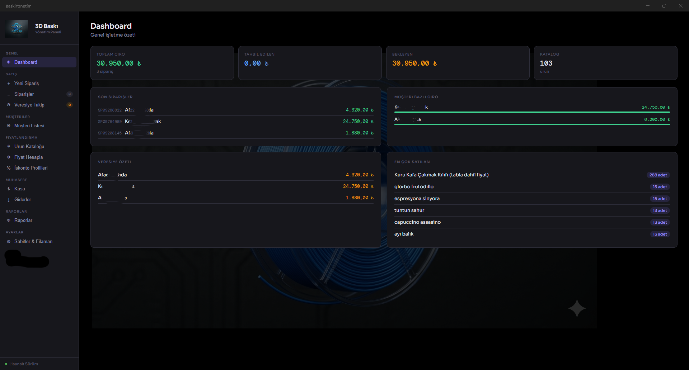
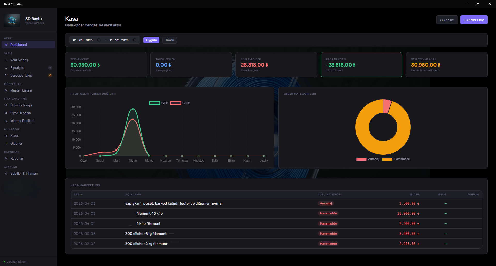
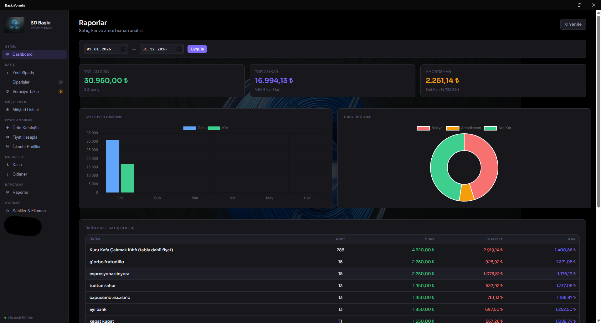
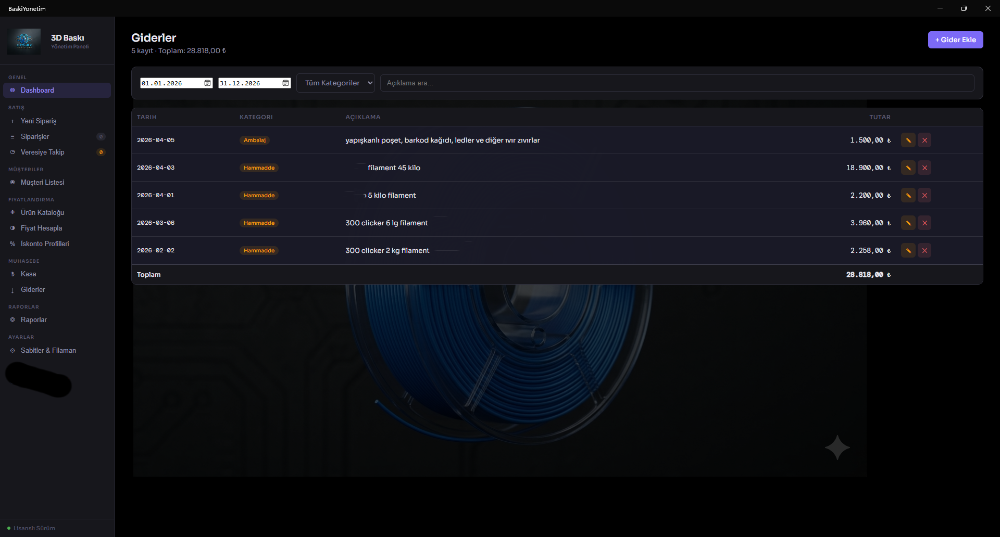
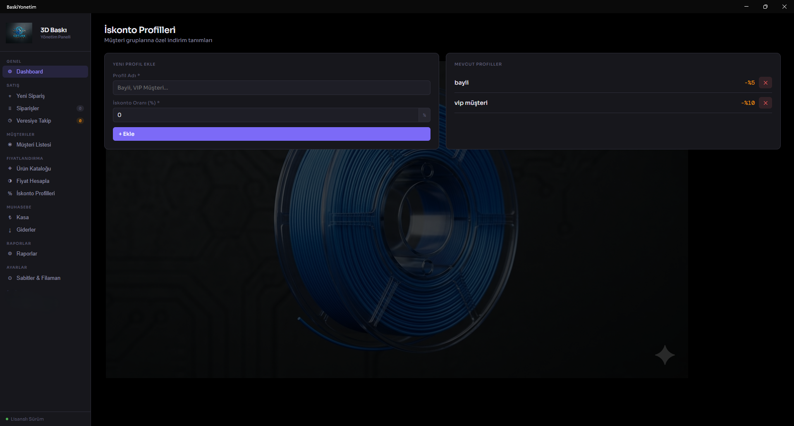
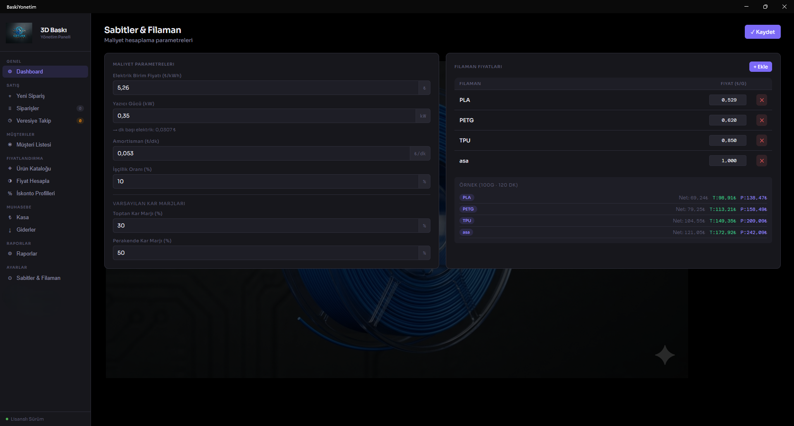

# BaskiYönetim

**3D Baskı İşletmeleri İçin Profesyonel Yönetim Paneli**

[⬇ İndir](#kurulum) · [📸 Ekran Görüntüleri](#ekran-görüntüleri) · [✨ Özellikler](#özellikler) · [📰 Tanıtım Yazısı](https://www.ozturk-web.com/haber/yerli-yazilim-baskiyonetim-v1-0-yayinlandi-3d-yazici-isletmeleri-icin-tam-cozum)

---

## 🎯 Nedir?

**BaskiYönetim**, 3D baskı işletmelerinin siparişlerini, maliyetlerini, müşterilerini ve stoklarını tek bir platformdan yönetmesini sağlayan profesyonel bir Windows masaüstü uygulamasıdır.

> *"Üretime odaklan, maliyet ve siparişleri biz takip edelim."*

---

## 👥 Kimler İçin?

| Kullanıcı | Açıklama |
|-----------|----------|
| 🏭 **3D Baskı Atölyeleri** | Birden fazla sipariş ve müşteriyi yöneten profesyonel atölyeler |
| 🎨 **Hobi Üreticiler** | Üretimini ticarete dönüştürmek isteyen maker'lar |
| 🛒 **E-Ticaret Satıcıları** | Online platformlarda 3D ürün satanlar |
| ⚙️ **Prototip Firmaları** | Müşteri bazlı prototip üretimi yapan firmalar |

---

## ✨ Özellikler

### 📦 Sipariş Yönetimi
- Sipariş oluşturma ve takip etme
- Toptan / perakende otomatik fiyatlandırma
- İskonto profilleri ile esnek indirim sistemi
- Veresiye, kısmi ödeme ve kalan borç takibi
- KDV dahil fiyat desteği

### 💰 Maliyet Hesaplama
- Gramaj ve baskı süresine göre anlık maliyet analizi
- Elektrik, amortisman ve işçilik otomatik hesaplama
- PLA · PETG · TPU · ASA filaman desteği
- Ürün bazlı özel işçilik oranı (karmaşık modeller için)

### 🖼️ Ürün Kataloğu
- **Sınırsız** ürün ekleme
- Ürün görseli, barkod ve kategori yönetimi
- Stok takibi
- Net maliyet, toptan ve perakende fiyat

### 👥 Müşteri Yönetimi
- Müşteri veritabanı ve cari hesap
- Sipariş geçmişi
- İskonto profili atama

### 🏦 Muhasebe
- Kasa — nakit akışı ve gelir/gider dengesi
- Kategori bazlı gider takibi
- Tahsilat yönetimi

### 📈 Raporlar
- Aylık kazanç ve kar marjı analizi
- Ürün bazlı satış raporu
- Amortisman analizi
- Stok durumu ve veresiye özeti

---

## 📸 Ekran Görüntüleri

<b>Dashboard</b>

 

<b>Fiyat Hesaplayıcı</b>

 

<b>Sipariş Oluşturma</b>

 

<b>Ürün Kataloğu</b>

 

<b>Kasa</b>

 

<b>Raporlar</b>

 

<b>Veresiye Takip</b>

 

<b>Müşteriler</b>

 

<b>Giderler</b>

 

<b>İskonto Profilleri</b>

 

<b>Sabitler & Filaman</b>

 

---

## ⚡ Avantajlar

| Özellik | Fayda |
|---------|-------|
| 🆓 **3 Gün Ücretsiz Deneme** | Risk almadan test edin |
| 🔒 **Veri Güvenliği** | Lisans sonrası verileriniz aynen kalır |
| ⚡ **Tek Kurulum** | Tüm bağımlılıklar otomatik yüklenir |
| 🔔 **Güncelleme Kontrolü** | Yeni sürümlerden haberdar olun |
| 🚀 **Hızlı ve Hafif** | Windows 10/11'de sorunsuz çalışır |
| 🌐 **İnternet Gerektirmez** | Yerel veritabanı, verileriniz bilgisayarınızda |

---

## 🚀 Kurulum

1. **[Releases](https://github.com/ozturkweb/3dBaskiYonetim-app/releases)** sayfasından son sürümü indirin
2. Kurulum dosyasını çalıştırın — tüm bağımlılıklar otomatik yüklenir
3. Uygulamayı açın ve **3 gün ücretsiz** deneyin
4. Beğendiyseniz lisans alın, kaldığınız yerden devam edin

---

## 🛠️ Teknik Detaylar

| | |
|--|--|
| **Dil / Framework** | C# · Blazor Hybrid (MAUI) |
| **Veritabanı** | SQLite (Microsoft.Data.Sqlite) |
| **Platform** | Windows 10 / 11 |
| **Dağıtım** | Visual Studio Installer Projects |
| **Lisanslama** | HMAC-SHA256 makine kilitli lisans |

---

## 📬 İletişim & Daha Fazla

- 🌐 **Web:** [ozturk-web.com](https://www.ozturk-web.com)
- 📁 **Portfolyo:** [Proje Detayı](https://www.ozturk-web.com/portfolyo-detay/baski-yonetim-paneli)
- 📰 **Tanıtım:** [v1.0 Duyuru Yazısı](https://www.ozturk-web.com/haber/yerli-yazilim-baskiyonetim-v1-0-yayinlandi-3d-yazici-isletmeleri-icin-tam-cozum)

---

**BaskiYönetim** · Geliştirici: [ozturk-web.com](https://www.ozturk-web.com) · Antalya 🇹🇷

