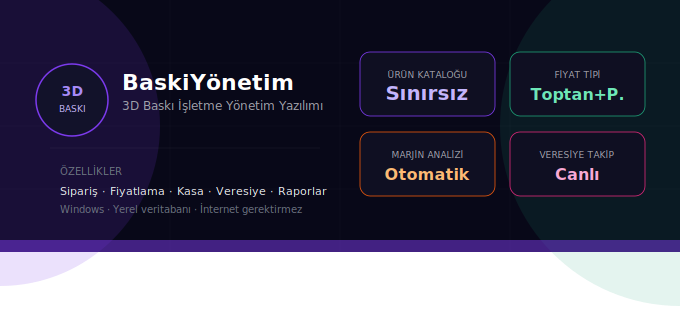
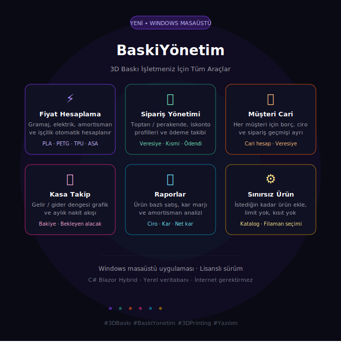
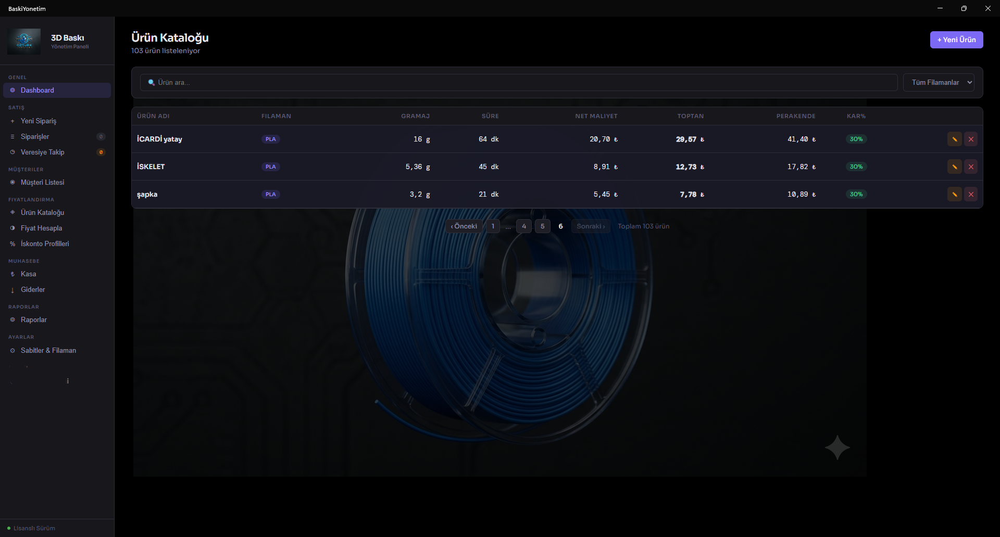
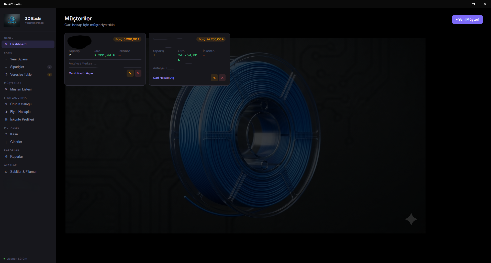

  

   

  <h1>🚀 BaskıYönetim v1.0.0</h1>
  
<b>3D Yazıcı İş Akışı ve Sipariş Yönetim Sistemi</b>

  

---

### ✨ Öne Çıkan Özellikler
Uygulama, 3D baskı süreçlerinizi profesyonel bir seviyeye taşımak için geliştirildi:

  

* **📦 Sipariş Takibi:** Gelen işleri adım adım (Hazırlanıyor, Basılıyor, Tamamlandı) izleyin.
* **💰 Maliyet Hesaplama:** Gramaj ve elektrik tüketimine göre anlık fiyatlandırın.
* **👥 Müşteri Yönetimi:** Kayıtlı müşteriler ve geçmiş sipariş datası.
* **📊 İstatistikler:** Aylık kazanç ve malzeme kullanım raporları.

---

### 📸 Uygulama Tanıtımı & Ekran Görüntüleri

#### 🏠 Ana Panel ve Ürün Yönetimi
<table>
  <tr>
    <td width="50%" align="center"> <b>Genel Bakış Dashboard</b></td>
    <td width="50%" align="center"> <b>Stok ve Ürün Yönetimi</b></td>
  </tr>
</table>

#### 💰 Fiyatlandırma ve Operasyon
<table>
  <tr>
    <td width="50%" align="center"> <b>Gelişmiş Maliyet Analizi</b></td>
    <td width="50%" align="center"> <b>İndirim ve Kampanya Yönetimi</b></td>
  </tr>
</table>

#### 📊 Finansal Takip ve Kasa
<table>
  <tr>
    <td width="33%" align="center"> <b>Nakit Akışı</b></td>
    <td width="33%" align="center"> <b>Borç/Alacak Takibi</b></td>
    <td width="33%" align="center"> <b>Gider Yönetimi</b></td>
  </tr>
</table>

#### 👥 Müşteri ve Raporlama
<table>
  <tr>
    <td width="50%" align="center"> <b>Müşteri Veritabanı</b></td>
    <td width="50%" align="center"> <b>Detaylı Analiz ve Raporlar</b></td>
  </tr>
</table>

#### ⚙️ Sistem Ayarları

  
   <em>Parametrik Ayarlar ve Sabit Tanımlamaları</em>

---

### 🛠️ Kurulum ve Başlangıç
1. [Buradan](https://github.com/ozturkweb/3dBaskiYonetim-app/releases/latest/download/BaskiYonetimSetup.exe) `.exe` dosyasını indirin.
2. Windows "SmartScreen" uyarısı verirse **Ek Bilgi** -> **Yine de Çalıştır** deyin.
3. Uygulamayı başlatın ve yerel veritabanınızı oluşturun.

---

### 📞 İletişim & Destek
- **Web:** [ozturk-web.com](https://ozturk-web.com)
- **LinkedIn:** [Murat Öztürk](https://linkedin.com/in/murat-öztürk-7561bb142)

  © 2026 Öztürk Yazılım - Murat Öztürk tarafından Antalya'da geliştirilmiştir.

